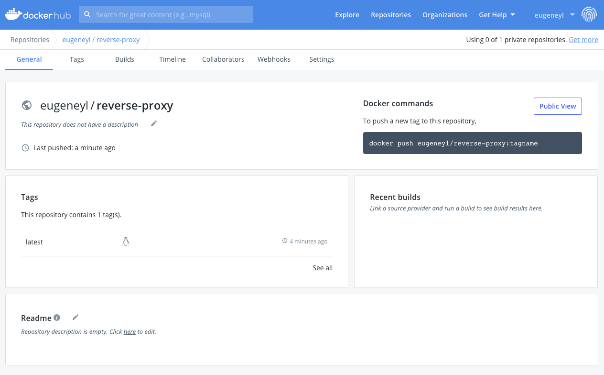

## CS 3219 OTOT Task A

Name: Eugene Yong

### Task

Deploy a simple web server using Nginx running in a Docker container

#### To run the docker container

1. Fork and clone this repo to your local machine.
2. Navigate to the repo directory via terminal. 
3. Build up the docker image based on the `Dockerfile`. You can specify the name of the docker image in `{image-name}`

````bash
docker build -t {image-name}
````

4. Start a copy of the container. I have exposed the docker container's internal port 80 to the local machine's port 8080.

````bash
docker run -it -rm -d -p 8080:80 --name {container-name} {image-name}
````

5. On a web browser, go to `localhost:8080`. 

#### Using the reverse-proxy

On `localhost:8080`, you will see a simple webpage from with a link. Click on the link, it will redirect you to `localhost:8080/redirect`, which will display the content of `html-files/proxy.html` through the reverse-proxy done by the Nginx web server.

#### Closing the container

In order to close the container, you can run the following commands.

```bash
docker stop {container-name}
docker rm {container-name}
```

### Docker Hub Upload

The docker image built from the `Dockerfile` in this repo is also available on DockerHub. You can access it at [this link](https://hub.docker.com/repository/docker/eugeneyl/reverse-proxy).




